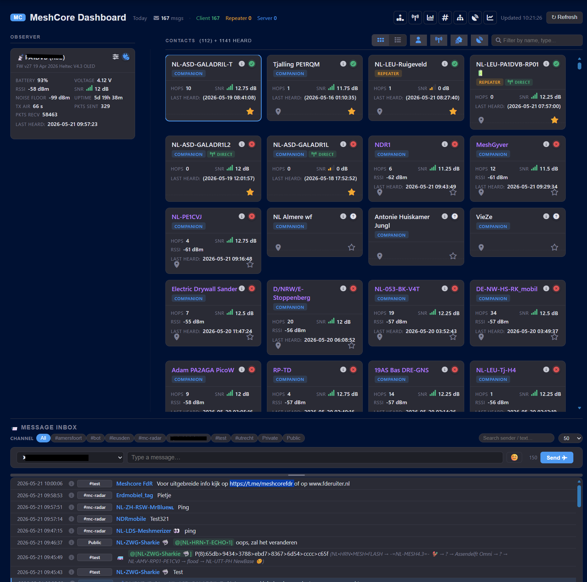
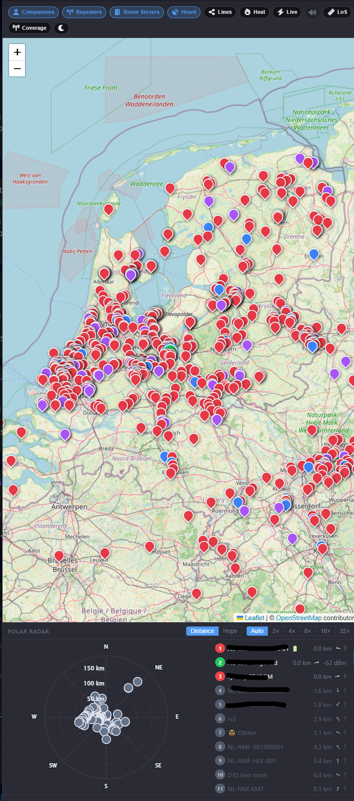
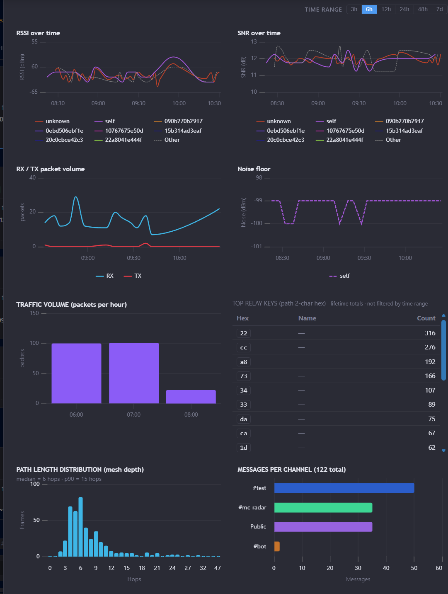
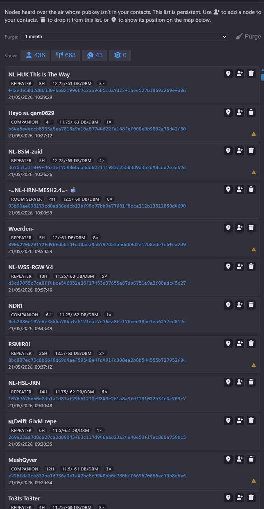
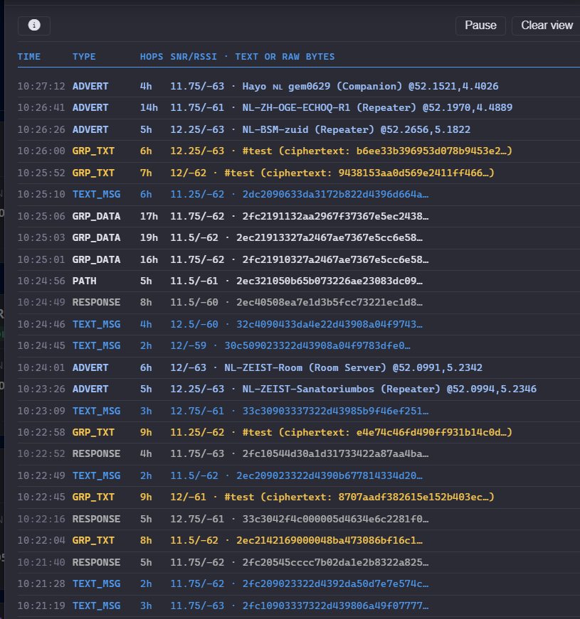
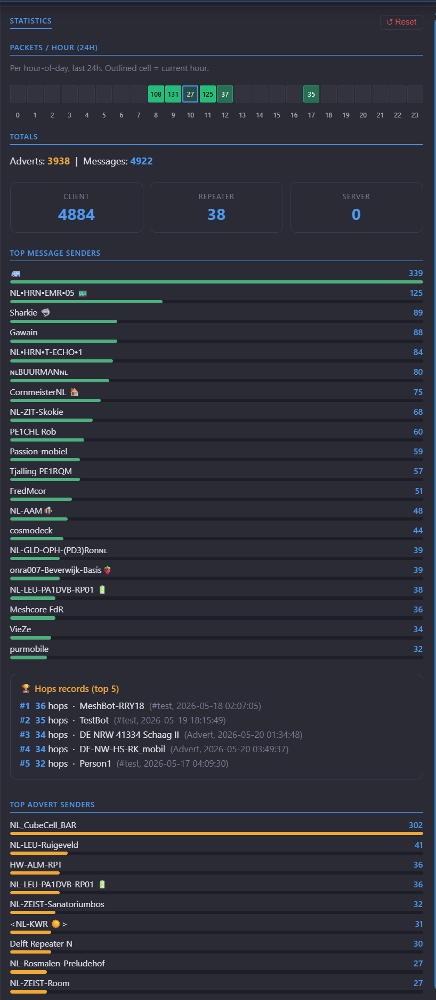
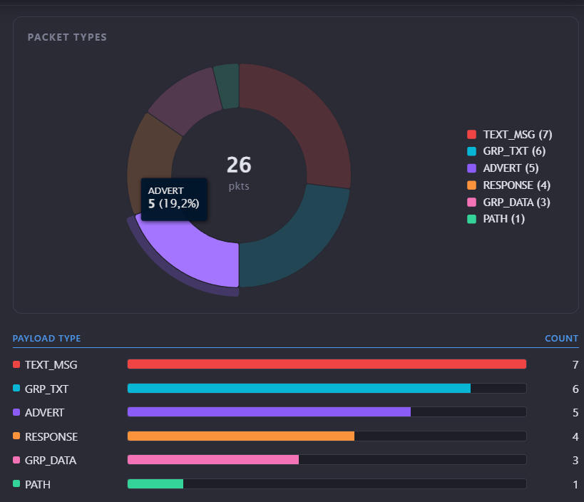

# 📡 Domoticz-MeshCore-Plugin


🔗 _MeshCore LoRa Mesh integration for Domoticz Home Automation_

This plugin connects your **[MeshCore LoRa mesh nodes](https://meshcore.io/)** to [Domoticz](https://www.domoticz.com/), exposing node telemetry, message inbox, and send controls as native Domoticz devices — ready for automations, dashboards and scripting.

> 📻 Track battery, signal quality and uptime of your connected node · 📨 Send & receive LoRa messages · 🖥️ Custom real-time dashboard included!

## 📖 Documentation

**Full documentation, configuration reference, device tables, automation examples and troubleshooting:**
👉 **[galadril.github.io/Domoticz-MeshCore-Plugin](https://galadril.github.io/Domoticz-MeshCore-Plugin/)**

----------

## ✨ Features

- **Auto-discovery** – All contacts advertised by the mesh are automatically discovered and tracked
- **Self-node Telemetry** – Battery, voltage, RSSI, SNR, noise floor, uptime, airtime and packet counters
- **Remote Node Status** – Online/offline detection, SNR, hops and last-seen for every discovered contact
- **Message Inbox** – Every received LoRa message appears in Domoticz with sender, channel and timestamp
- **Send Messages** – Send direct or channel messages from Domoticz or the dashboard
- **Custom Dashboard** – Built-in real-time dark-mode dashboard with node cards, message history and compose bar
- **Node Map** – Interactive Leaflet map with GPS coordinates, path lines and activity heatmap
- **Historical Analytics** – RSSI, SNR, packet volume, top relay keys and per-channel stats (SQLite-backed, 30-day window)
- **DM Threads** – Per-contact conversation history with delivery ACK markers
- **Heard Nodes** – Track and filter non-contact adverts with bulk purge
- **Coverage & LoS Tools** – Terrain-aware propagation map and per-link path-profile chart
- **dzVents Bridge** – React to LoRa commands from any mesh node via dzVents Lua scripts
- **Push Events** – Incoming messages, adverts and status responses in real time
- **Auto-reconnect** – Automatic reconnect on connection loss; stale-link detection after 10 min

----------

## 📊 Screenshots



<table>
  <tr>
    <td align="center" width="33%">
      <a href="docs/images/topology.png"></a>
      <br/><sub><b>Mesh topology</b> — multi-hop path lines</sub>
    </td>
    <td align="center" width="33%">
      <a href="docs/images/history_charts.png"></a>
      <br/><sub><b>Historical analytics</b> — RSSI, SNR, packets…</sub>
    </td>
    <td align="center" width="33%">
      <a href="docs/images/heard_nodes.png"></a>
      <br/><sub><b>Heard nodes</b> — non-contact adverts</sub>
    </td>
  </tr>
  <tr>
    <td align="center" width="33%">
      <a href="docs/images/firehose.png"></a>
      <br/><sub><b>RX firehose</b> — live packet stream</sub>
    </td>
    <td align="center" width="33%">
      <a href="docs/images/statistics.png"></a>
      <br/><sub><b>Statistics</b> — totals and leaderboards</sub>
    </td>
    <td align="center" width="33%">
      <a href="docs/images/packet_types.png"></a>
      <br/><sub><b>Packet types</b> — donut breakdown</sub>
    </td>
  </tr>
</table>

----------

## ⚙️ Installation

> **Minimum: Domoticz build `17956` (2025.2.17956) · Python 3.6+ · `pip install meshcore`**

```sh
cd ~/domoticz/plugins
git clone https://github.com/galadril/Domoticz-MeshCore-Plugin.git MeshCore   # folder name is just a convention
cd MeshCore
pip install -r requirements.txt
sudo service domoticz.sh restart
```

Then go to **Setup → Hardware** and add a new entry of type **MeshCore**.

**Docker:** add `pip3 install meshcore` (or `pip3 install --break-system-packages meshcore` on Debian 12) to your `customstart.sh` hook so it persists across image rebuilds.

> For full configuration options, device reference, and the custom dashboard guide see the **[documentation site](https://galadril.github.io/Domoticz-MeshCore-Plugin/)**.

----------

## 🔄 Updating

```sh
cd ~/domoticz/plugins/MeshCore
git pull
sudo service domoticz.sh restart
```

> **DomoticzEx migration:** if upgrading from an old version, delete orphaned per-node devices via _Setup → Devices_ (filter by MeshCore hardware). The plugin recreates them automatically. See [docs](https://galadril.github.io/Domoticz-MeshCore-Plugin/#updating) for details.

----------

## 🕘 Changelog

| Version | Date | Highlights |
|---|---|---|
| **v0.0.7** | May 2026 | Automated GitHub Actions release workflow |
| **v0.0.6** | May 2026 | Map tools, coverage/LoS terrain tools, historical analytics panel |
| **v0.0.5** | May 2026 | dzVents command bridge, inbox filters, clock-skew fix |
| **v0.0.4** | May 2026 | Dashboard UI/theming fixes, collapsible node settings |
| **v0.0.3** | May 2026 | WebSocket dashboard, SQLite message store, serial transport |
| **v0.0.2** | Apr 2026 | dzVents example scripts (status reporter, chat responder) |
| **v0.0.1** | Apr 2026 | Initial release — telemetry, inbox, send, custom dashboard |

Full release notes: [GitHub Releases](https://github.com/galadril/Domoticz-MeshCore-Plugin/releases)

----------

## 💬 Support

For bugs or feature requests: [GitHub Issues](https://github.com/galadril/Domoticz-MeshCore-Plugin/issues)

----------

## ☕ Donate

If this plugin saves you time, consider buying me a coffee (or 🍺 beer)!

[](https://www.paypal.me/markheinis)

----------

## 📄 License

This project is licensed under the **MIT License**.
See the [LICENSE](LICENSE) file for details.
